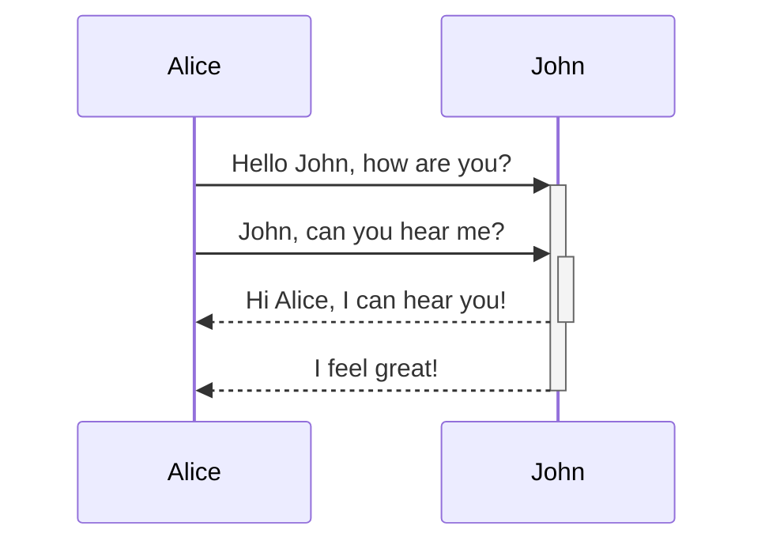

## Telegram bot

required VM options:

```
telegram.bot.name={some_bot};
telegram.bot.token={some_token};
telegram.bot.webhook.path={some_url}
```


https://github.com/GoogleContainerTools/jib
https://habr.com/ru/companies/jugru/articles/505994/
